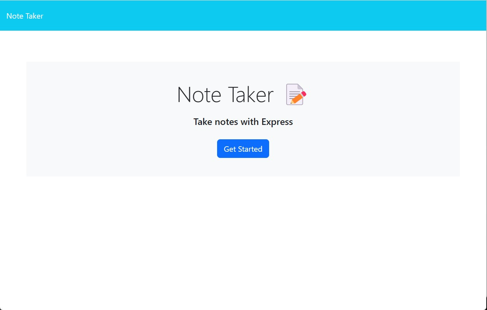
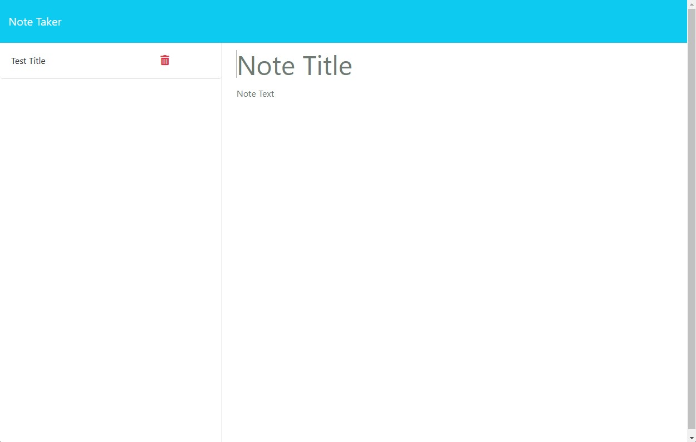

# Note Taker Starter Code

In this assignment we had to create a note-taking application using Express.js

## Links

Repository: https://github.com/nobrien1996/note-taking-app

Deployed repository: https://nobrien1996.github.io/note-taking-app/

Render deployment: https://note-taking-app-drni.onrender.com

## Screenshots

